#  Face Detection using SSD+MobileNet-v2 Trained on WIDER FACE Dataset

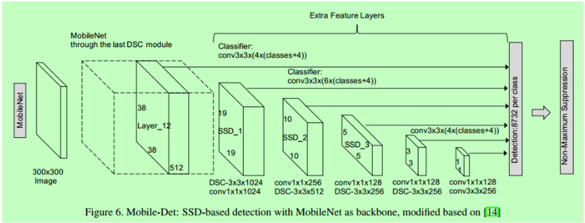

## 1. Objective

In this project, we shall demonstrate the Deep Learning (DL) inference using a DL object detection model, SSD+MobileNet-v2, which has already been trained on the WIDER FACE dataset, to detect human faces.

## 2. SSD+MobileNet-v2

* SSD+MobileNet-v2 is a state-of-the-art, real-time object detection model. It is not straight forward to reasonably train this network from scratch, due to several reasons including: 

  * Lack of large volume of annotated data 
  * Lack of sufficiently powerful computing resources.

* Instead of exploring the training of SSD+MobileNet from scratch we use an already trained model retrieved from the following source: 
    * Trained SSD-MobileNet-v2 model source: https://github.com/Fszta/Tensorflow-face-detection
    * This model has been trained on the WIDER FACE dataset:
      * Source: http://shuoyang1213.me/WIDERFACE/
      * WIDER FACE dataset is a face detection benchmark dataset, of which images are selected from the publicly available WIDER dataset.
      * It has 32,203 images and label 393,703 faces with a high degree of variability in scale, pose and occlusion as depicted in the sample images.
      * WIDER FACE dataset is organized based on 61 event classes.
      * For each event class, we randomly select 40%/10%/50% data as training, validation and testing sets

In this work, we shall demonstrate how to deploy the trained model to detect objects of interest:

## 3. Development

* Project:  Face Detection using SSD+MobileNet-v2 Trained on WIDER FACE Dataset:
  * The objective of this project is to demonstrate how to use the state of the art in object detection. 

* Author: Mohsen Ghazel (mghazel)
* Date: April 15th, 2021

### 3.1. Step 1: Imports and global variables

#### 3.1.1. Python import:

<pre style="color:#000020;background:#e6ffff;font-size:10px;line-height:1.5;">#------------------------------------------------------
# Python imports and environment setup
#------------------------------------------------------
# opencv
import cv2
# numpy
import numpy as np
# matplotlib
import matplotlib.pyplot as plt
import matplotlib.image as mpimg

# tensorflow
import tensorflow as tf

# utilities functionalities
from utils import label_map_util
# visualization utilities functionalities
from utils import visualization_utils_color as vis_util

# input/output OS
import os 

# date-time to show date and time
import datetime
# import time
import time

# to display the figures in the notebook
%matplotlib inline

#------------------------------------------
# Test imports and display package versions
#------------------------------------------
# Testing the OpenCV version
print("OpenCV : ",cv2.__version__)
# Testing the numpy version
print("Numpy : ",np.__version__)

OpenCV :  3.4.8
Numpy :  1.19.2
</pre>

### 1.2. Global variables:

<pre style="color:#000020;background:#e6ffff;font-size:10px;line-height:1.5;">#----------------------------------------------------------------
# Path to the trained SSD-MobileNet-v2 frozen detection graph:
#----------------------------------------------------------------
# This is the actual model that is used for the object detection.
PATH_TO_CKPT = './model/frozen_inference_graph.pb'

#----------------------------------------------------------------
# List of the strings that is used to add correct label for each 
# box.
#----------------------------------------------------------------
PATH_TO_LABELS = './proto/label_map.pbtxt'

#----------------------------------------------------------------
# Since the model was trained to detected human faces: 
#----------------------------------------------------------------
# Number of classes = 1: FACE
#----------------------------------------------------------------
NUM_CLASSES = 1

#----------------------------------------------------------------
# The detection confidence threshold: 
#----------------------------------------------------------------
# - Only detections with confidence higher than this threshold 
#   are kept.
#----------------------------------------------------------------
DETECTION_CONFIDENCE_THRESHOLD = 0.50
#----------------------------------------------------------------
# Set test images folder name: 
#----------------------------------------------------------------
# Selected 10 test images from the WIDER-FACE TEST 
# data subset
#----------------------------------------------------------------
test_images_folder = 'images/wider-face--10-test-images/'
</pre>

### 4.2. Step 2: Implement the DL inference of the trained SSD-MobilenNet-v2 model:
* We now run deploy the trained SSD-MobileNet-v2 model to detect faces from test images
* Selected 10 test images from the WIDER-FACE TEST data subset

<pre style="color:#000020;background:#e6ffff;font-size:10px;line-height:1.5;">#----------------------------------------------------------------
# Load label map
#----------------------------------------------------------------
# - This allows us to map the class ID to class name
#----------------------------------------------------------------
# get the label-map
label_map = label_map_util.load_labelmap(PATH_TO_LABELS)
# get the class categories/names
categories = label_map_util.convert_label_map_to_categories(label_map, max_num_classes=NUM_CLASSES, use_display_name=True)
# get the class categories indices
category_index = label_map_util.create_category_index(categories)

#----------------------------------------------------------------
# Start the face detection inference:
#----------------------------------------------------------------
def face_detection():

    # Load Tensorflow model
    detection_graph = tf.Graph()
    with detection_graph.as_default():
        #--------------------------------------------------------
        # FIXED ERROR: AttributeError: module 'tensorflow' has no attribute 'GraphDef'
        #--------------------------------------------------------
        # tf.compat.v1.GraphDef()   # -&gt; instead of tf.GraphDef()
        #--------------------------------------------------------
        # od_graph_def = tf.GraphDef()
        #--------------------------------------------------------
        od_graph_def = tf.compat.v1.GraphDef()
        #--------------------------------------------------------
        # FIXED THE ERROR: AttributeError: module 'tensorflow' has no attribute 'gfile'
        #--------------------------------------------------------
        # 1.Find label_map_util.py line 137.
        # 2.Replace tf.gfile.GFile to tf.io.gfile.GFile
        #--------------------------------------------------------
        # with tf.gfile.GFile(PATH_TO_CKPT, 'rb') as fid:
        #--------------------------------------------------------
        with tf.io.gfile.GFile(PATH_TO_CKPT, 'rb') as fid:
            serialized_graph = fid.read()
            od_graph_def.ParseFromString(serialized_graph)
            tf.import_graph_def(od_graph_def, name='')
        
        #--------------------------------------------------------
        # FIXED ERROR: AttributeError: module 'tensorflow' has no attribute 'Session'
        #--------------------------------------------------------
        # According to TF 1:1 Symbols Map, in TF 2.0 you should use tf.compat.v1.Session() instead of tf.Session()
        #--------------------------------------------------------
        # sess = tf.Session(graph=detection_graph)
        #--------------------------------------------------------
        sess = tf.compat.v1.Session(graph=detection_graph)
        
    image_tensor = detection_graph.get_tensor_by_name('image_tensor:0')

    # Each box represents a part of the image where a particular object was detected.
    detection_boxes = detection_graph.get_tensor_by_name('detection_boxes:0')

    # Each score represent how level of confidence for each of the objects.
    # Score is shown on the result image, together with the class label.
    detection_scores = detection_graph.get_tensor_by_name('detection_scores:0')

    # Actual detection.
    detection_classes = detection_graph.get_tensor_by_name('detection_classes:0')
    num_detections = detection_graph.get_tensor_by_name('num_detections:0')

    #------------------------------------------------------
    # Itetate over all the images in the test images 
    # folder, and detect human faces using the trained 
    # SSD-MobbileNET-ve model
    #------------------------------------------------------
    # initialize the image counter
    image_counter = 0
    for filename in os.listdir(test_images_folder):
        #------------------------------------------------------
        # read the test image
        #------------------------------------------------------
        frame = cv2.imread(os.path.join(test_images_folder,filename))
        # check if image was read properly
        if frame is not None:
            # increment the image counter
            image_counter = image_counter + 1
            #------------------------------------------------------
            # Deploy the YOLO model to conduct inference in 
            # the image
            #------------------------------------------------------
            # Expand dimensions since the model expects images to have shape: [1, None, None, 3]
            expanded_frame = np.expand_dims(frame, axis=0)
            (boxes, scores, classes, num_c) = sess.run(
                [detection_boxes, detection_scores, detection_classes, num_detections],
                feed_dict={image_tensor: expanded_frame})

            #------------------------------------------------------
            # Visualization of the face detection results
            #------------------------------------------------------
            vis_util.visualize_boxes_and_labels_on_image_array(
                frame,
                np.squeeze(boxes),
                np.squeeze(classes).astype(np.int32),
                np.squeeze(scores),
                category_index,
                use_normalized_coordinates=True,
                line_thickness=3,
                min_score_thresh=DETECTION_CONFIDENCE_THRESHOLD)

            # display the frame with overlaid face detections results
            # create a figure
            plt.figure(figsize=(8, np.uint8(8 * frame.shape[0]/frame.shape[1])))
            # visualize detection results
            plt.subplot(111)
            plt.title("SSD-MobileNet-v2: Face detection results", fontsize=12)
            plt.xticks([]), plt.yticks([])
            plt.imshow(cv2.cvtColor(frame, cv2.COLOR_BGR2RGB))
            # save the image
            cv2.imwrite('images/face-detection-results/' + 'test-image-0' + str(image_counter) + '.jpg', frame) 
            
            

if __name__ == '__main__':
    face_detection()
</pre>

### 4.5. Step 5: Display a successful execution message:

<pre style="color:#000020;background:#e6ffff;font-size:10px;line-height:1.5;"># display a final message
# current time
now = datetime.datetime.now()
# display a message
print('Program executed successfully on: '+ str(now.strftime("%Y-%m-%d %H:%M:%S") + "...Goodbye!\n"))

Program executed successfully on: 2021-04-15 10:36:19...Goodbye!
</pre>

## 4. Sample Face Detection Results

* In this section, we illustrate sample face and eyes detection results from the same 10 test images used for testing the Haar Cascades face detector. These images were selected from the WIDER FACE Test data subset.

<table>
  <tr>
    <td> 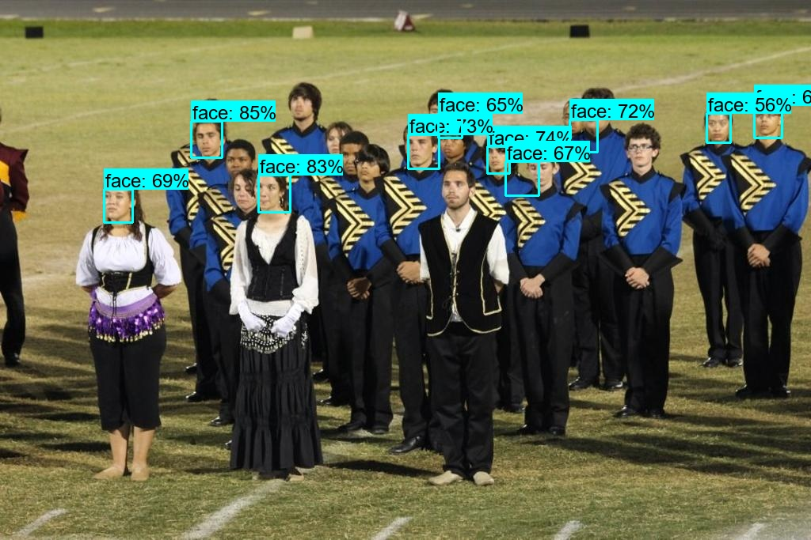</td>
    <td> 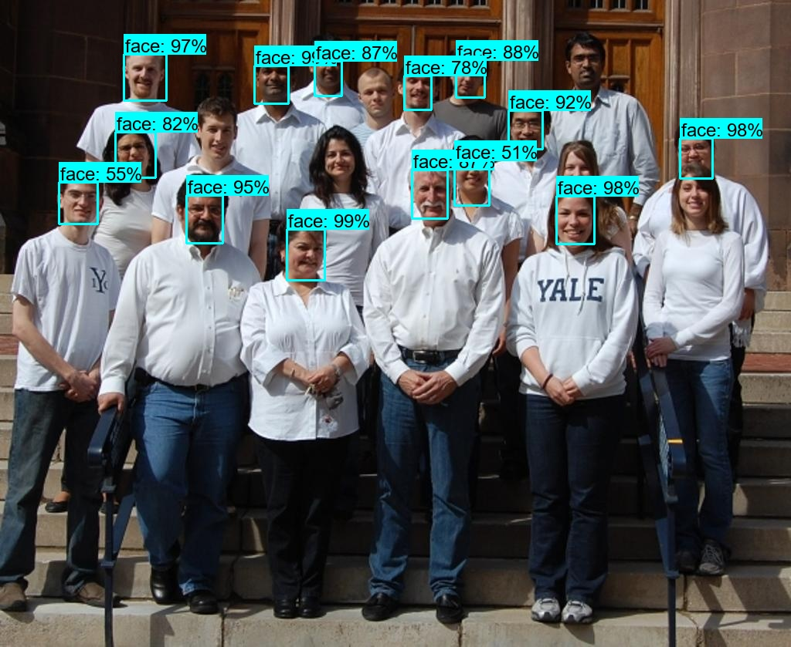</td>
   </tr> 
   <tr>
      <td> 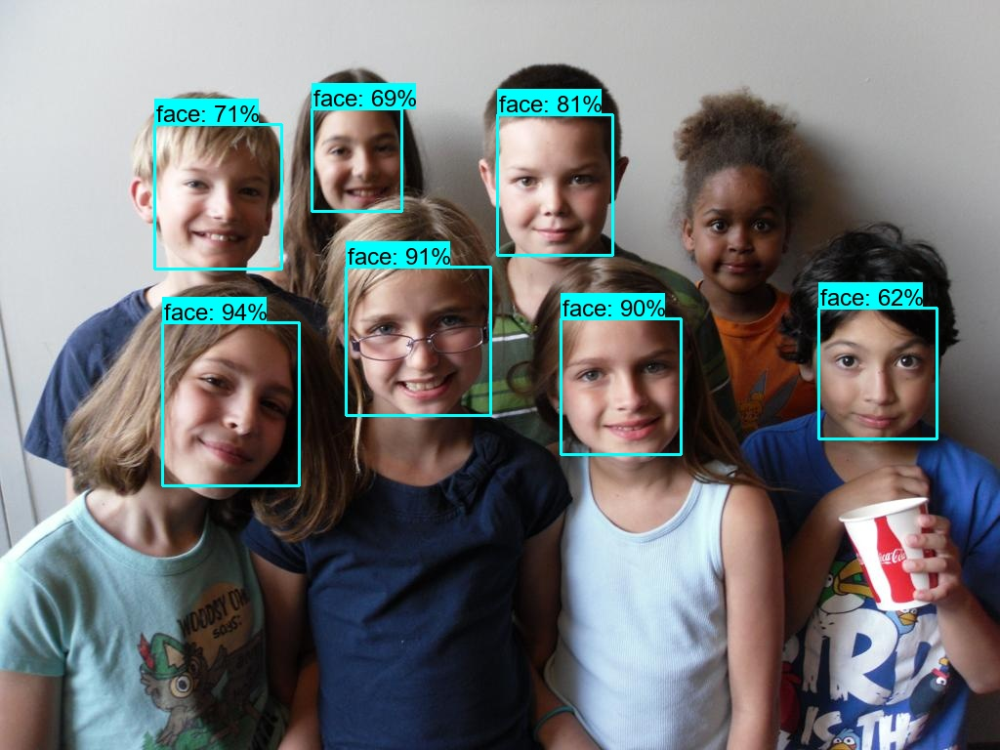</td>
      <td> 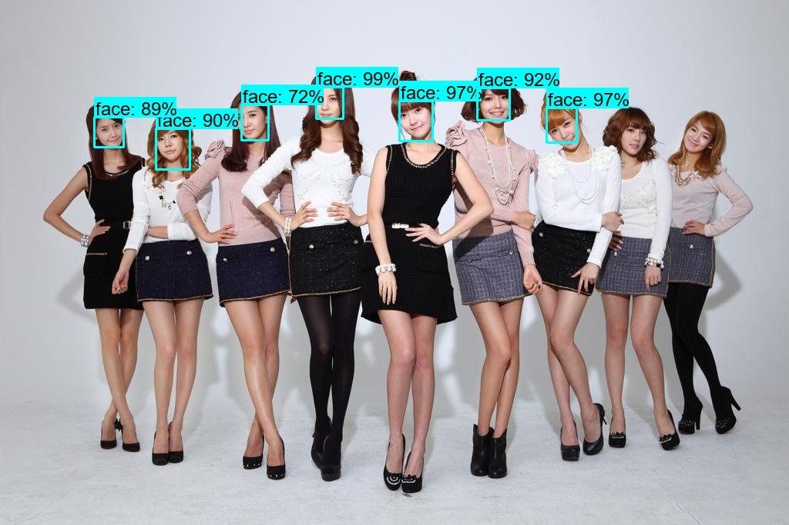</td>
  </td>
  <tr>
      <td> 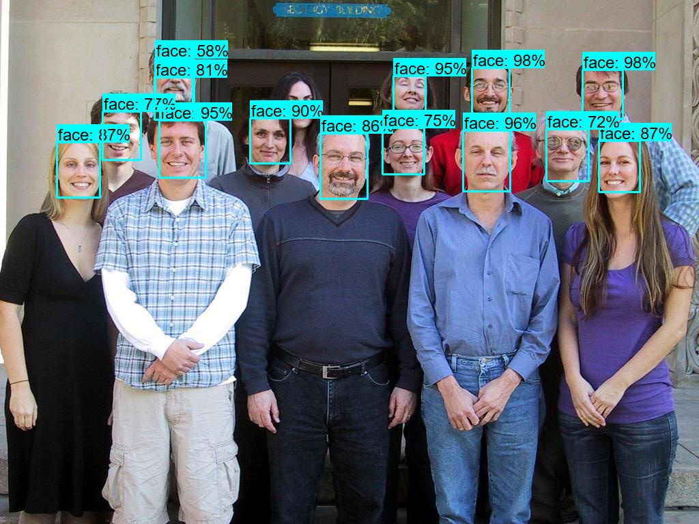</td>
      <td> 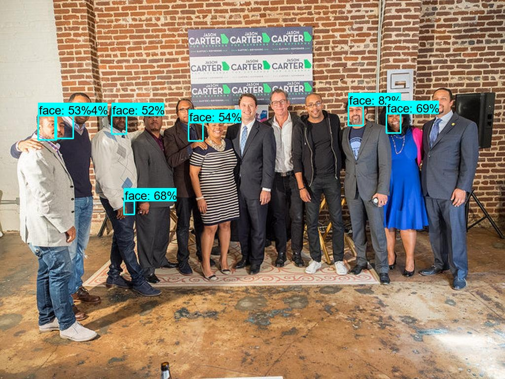</td>
  </td>
  <tr>
      <td> 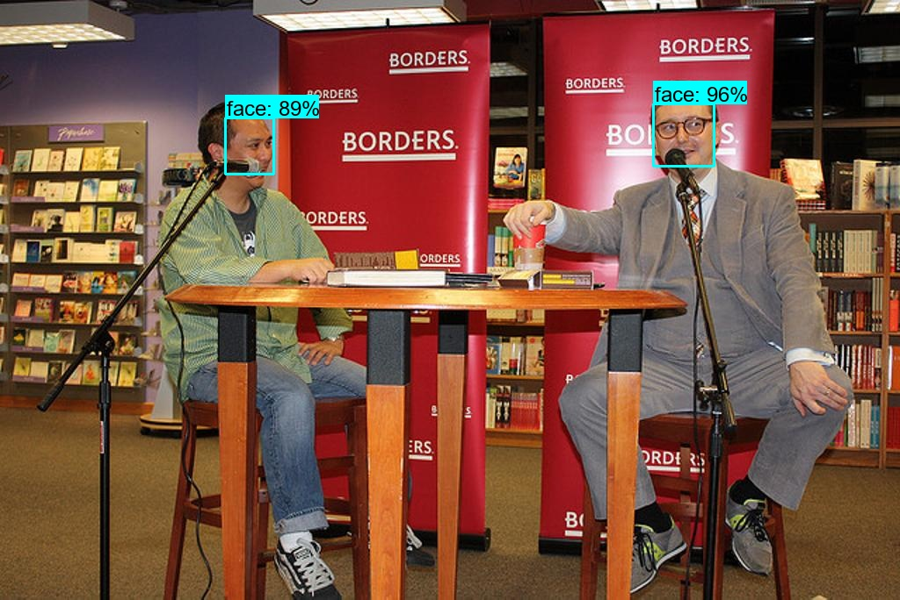</td>
      <td> 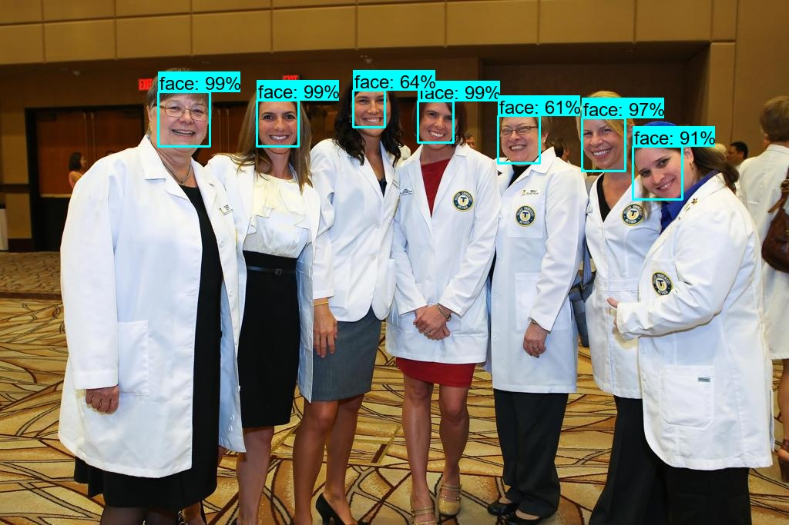</td>
  </td>
  <tr>
      <td> 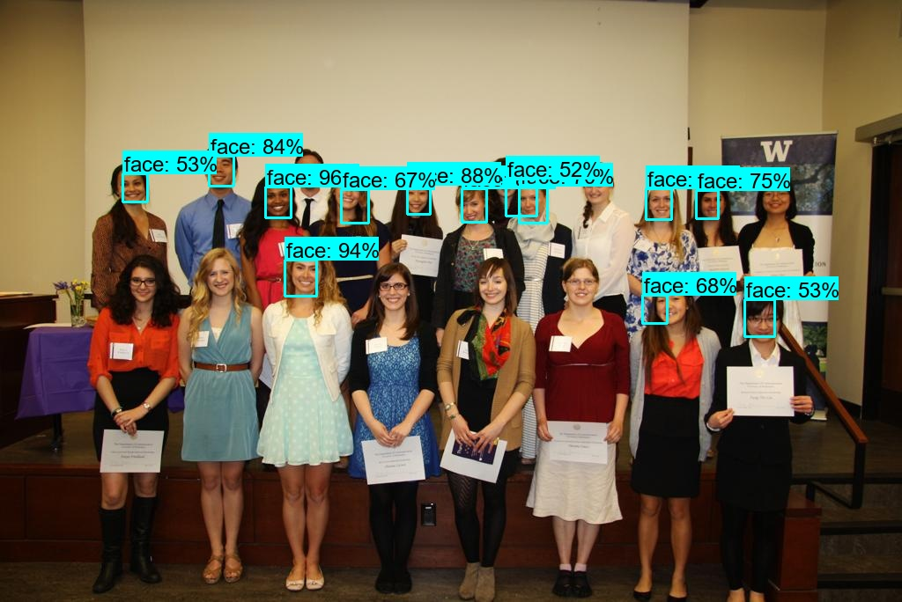</td>
      <td> 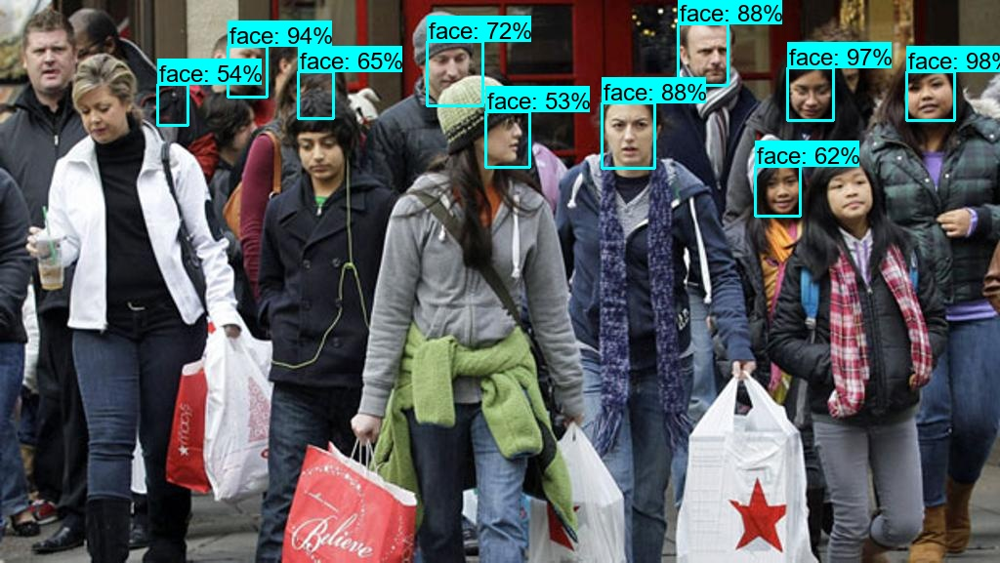</td>
  </td>
  </tr>
</table>

## 5. Analysis

* In view of the presented results, we make the following observations:

  * The face detection results generated by the SSD+MobileNet-v2 DL object detection model, which was trained on the WIDER FACE dataset, are superior to those generated by the Haar Cascades face detector, presented in Section 5.1:
  * We used the  same  10 test images used for testing the Haar Cascades face detector. 
  * These images were selected from the WIDER FACE test data subset.
  * Unlike the Haar Cascaades face detector, we observe the following about the trained SSD+MobileNet-v2 face detector:
    * Very few false-positives are observed
    * Some of the missed detections for clearly visible faces are just puzzling
    * It is not so sensitive to the face pose: It is able to detect most of the turned face
    * It is not so sensitive face scale: It is  able to detect most of the far and small faces
    * It is not so sensitive skin tone: It is able to detect some of the faces with darker skin tones.
    * It is not so sensitive obstruction: It is able to detect some of the partially obscured faces.
    * In spite of its superior performance, the trained SSD+MobileNet-v2 face detector is not without limitations:
      * There are missed detections that are clear faces
      * It missed most of the small or rotated faces.

## 7. Future Work

* We plan to investigate some of the related issues:

* Get a better understanding of the SSD+MobileNet-v2 model structures details 
* Test the trained SSD+MobileNet-v2 with more diverse data and identity their limitations
* Search for and test other pre-trained SSD+MobileNet-v2 face  detectors.

## 7. References

1. Fszta. Tensorflow-face-detection. https://github.com/Fszta/Tensorflow-face-detection 
2. WIDER FACE. WIDER FACE: A Face Detection Benchmark. http://shuoyang1213.me/WIDERFACE/ 
3. Mayank Singhal. Object Detection using SSD Mobilenet and Tensorflow Object Detection API: Can detect any single class from coco dataset. https://medium.com/@techmayank2000/object-detection-using-ssd-mobilenetv2-using-tensorflow-api-can-detect-any-single-class-from-31a31bbd0691 
4. Awesome Open Source. Face Detection With SSD+Mobilenet. https://awesomeopensource.com/project/bruceyang2012/Face-detection-with-mobilenet-ssd 
5. Horned Sungem. SSD+MobileNet Face Detector. https://hornedsungem.github.io/Docs/en/model/graph_face_ssd/ 
6. Analytics Vidhya. How to Build A Real-Time Face Mask Detector. https://medium.com/analytics-vidhya/real-time-face-mask-detector-8b484a5a6de0 
7. Pranilshinde. Face-Mask Detector Using TensorFlow-Object Detection(SSD+MobileNet). https://medium.com/pranil-shinde/face-mask-detector-using-tensorflow-object-detection-ssd-mobilenet-37f233202c67
 
